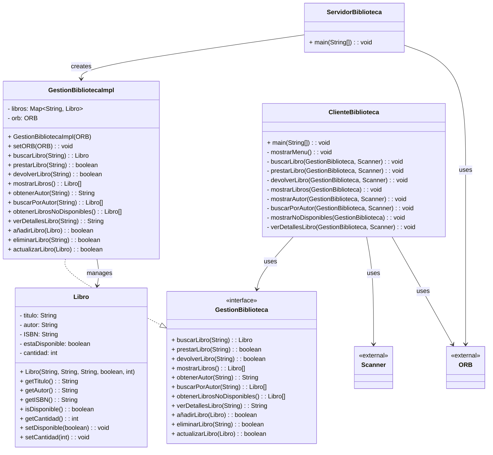

# README P3 - Distribuidos

## Versiones utilizadas

Un ORB compatible con CORBA para Java, como el que viene integrado en el JDK.

Java Development Kit(JDK) en Eclipse Temurin 1.8.

## Ejecución de la práctica:

## Compilación y ejecución de la aplicación CORBA

Primero, compila los archivos IDL para generar los stubs y esqueletos requeridos por CORBA (esto creará la carpeta  
[Biblioteca](src/Biblioteca)):

bash
idlj -fall Biblioteca.idl
`
Después, compila los archivos .java correspondientes al servidor y al cliente:

bash
javac ServidorBiblioteca.java

javac ClienteBiblioteca.java

### Ejecución del Servidor y Cliente

Inicia el servicio de nombres de CORBA utilizando el puerto 1050:

tnameserv -ORBInitialPort 1050

En una terminal diferente, lanza el servidor de la biblioteca:
bash
java ServidorBiblioteca

ORBInitialHost localhost

ORBInitialPort 1050

Por último, en otra terminal, ejecuta el cliente de la biblioteca:

bash
java ClienteBiblioteca -ORBInitialHost localhost -ORBInitialPort 1050

## Diagrama de flujo:

